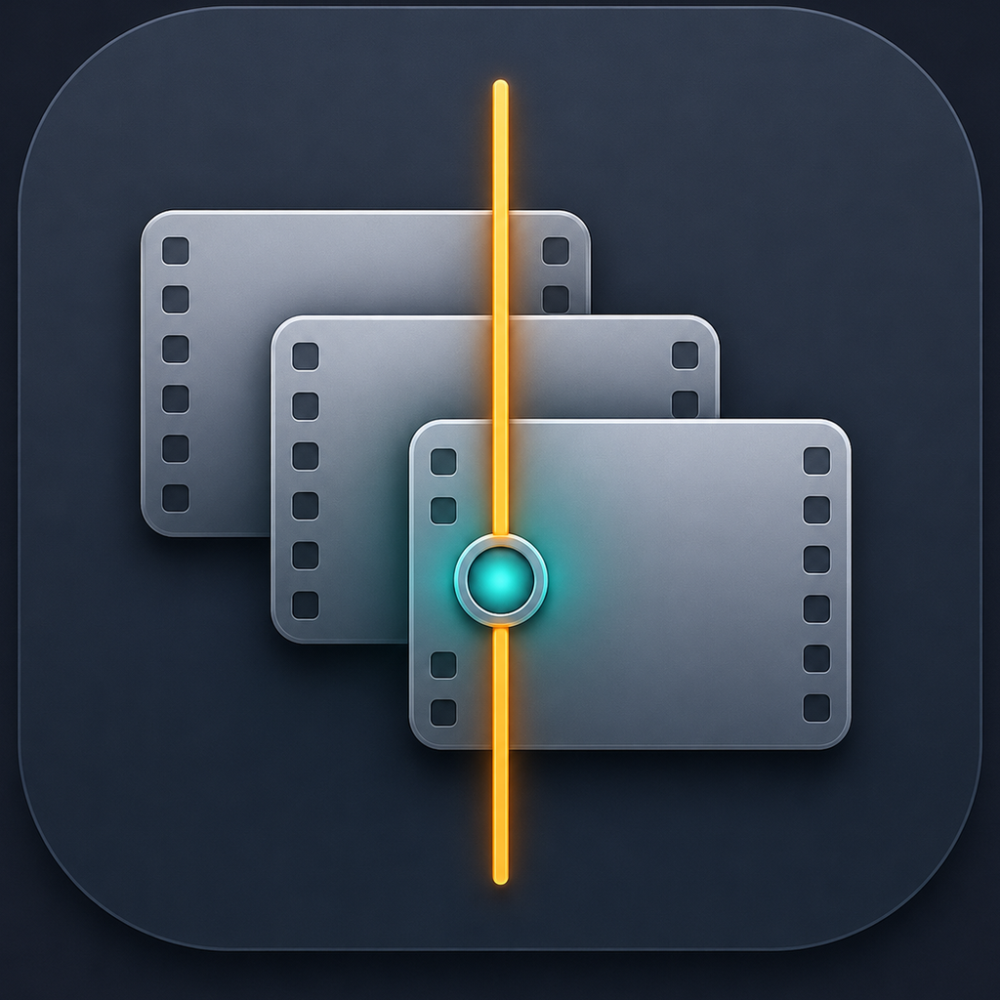

<div align="center">
  

# Logic Video Cue

給 Logic Pro 使用的開源 macOS 多影片同步播放器

[English](README.en.md) · [安裝與 Logic 設定](Docs/第一次安裝與Logic設定.md) · [問題回報](CONTRIBUTING.md)

**Original creator & maintainer: [Kao Ko Feng](AUTHORS.md)**
</div>

Logic Video Cue 讓多支 MOV／MP4 保持為獨立 Cue，透過 Logic 傳出的
MIDI Time Code（MTC）與 MIDI Machine Control（MMC）跟隨播放、停止與定位，
不需要先把所有短片串成一支長影片。

> [!IMPORTANT]
> 目前是 source-only beta。專案尚未提供經 Developer ID 簽章與 Apple 公證的
> 官方二進位檔；請從原始碼自行建置。這個專案與 Apple Inc. 無關，也未受其背書。

## 適合什麼工作流程

- 遊戲、廣告、短片或多個版本的配樂與音效製作。
- 希望影片播放從 Logic 卸載到獨立 App。
- 同一個 Logic 專案需要管理多支短影片，而不是一支拼接長片。
- 雙螢幕工作，需要獨立置頂或全螢幕輸出視窗。

## 主要功能

- 獨立 macOS App，內嵌 `Logic Video Cue: Link` AUv3。
- AU 連結狀態隨 Logic 專案儲存；再次開啟 Logic 時自動載入對應 `.lvcue`。
- Finder 多檔拖放、固定間隔排列或首尾相接。
- 原生繁體中文／英文介面，依 macOS 或個別 App 語言設定自動切換。
- 追加影片不移動既有 Cue；替換影片保留原 Timecode。
- MTC Quarter Frame／Full Frame 與 MMC Locate／Play／Pause／Stop。
- 24、25、29.97 DF、30、50、60 fps Timeline 顯示。
- 影片原音、同步補償、雙螢幕輸出、置頂與全螢幕。
- 輸出視窗顯示 `小時:分鐘:秒.毫秒`。
- 專案完全在本機運作，不含網路、分析或遙測功能。

## 系統需求

- macOS 14 Sonoma 或更新版本。
- Xcode 16 或相容版本（只在本機編譯時需要）。
- Logic Pro 11／12；較舊版本可能可透過傳統 MTC／MMC 設定使用，但未完整測試。

App 介面支援繁體中文與英文，會依 macOS 系統語言自動切換。也可在
「系統設定 → 一般 → 語言與地區 → 應用程式」只變更 Logic Video Cue 的語言；
不需要在 App 內另外切換。

## 從原始碼開始

1. 下載或 clone 此 repository。
2. 從 App Store 安裝並開啟一次 Xcode。
3. 雙擊 `Build_Logic_Video_Cue.command`。
4. 建置完成後，將 `Build/LogicVideoCue.app` 拖到「應用程式」。
5. 先開啟 Logic Video Cue，再開啟 Logic Pro。

也可以直接用 Xcode 開啟 `LogicVideoCue.xcodeproj`，Scheme 選擇
`LogicVideoCue > My Mac` 後按 `Command-R`。

不需要付費 Apple Developer 帳號即可在自己的 Mac 本機建置。完整設定請見
[第一次安裝與 Logic Pro 設定](Docs/第一次安裝與Logic設定.md)。

## Logic 快速設定

1. `File → Project Settings → Synchronization → MIDI`
2. Destination 選擇 `Logic Video Cue Sync In`。
3. 對該 Destination 開啟 MTC 與 MMC。
4. 開啟 `Transmit MIDI Machine Control (MMC)`。
5. `Synchronization → General` 的 Sync Mode 保持 `Internal`。
6. 在未使用的 Aux 插入：
   `Audio Units → Logic Video Cue → Logic Video Cue: Link`
7. App 儲存 `.lvcue` 後按「連結目前 Cue 專案」，再回 Logic 按 `Command-S`。

MTC／MMC Destination 和 Link AU 都是 Logic 專案設定。建議將它們存進常用的
Logic Project Template。

## 專案資料與隱私

- `.lvcue` 是 JSON 文件，包含 Cue、Timecode、設定與影片的絕對路徑。
- App 不會上傳影片、專案或使用資料。
- 把 `.lvcue` 附加到公開 Issue 前，請先移除私人檔名與本機路徑。
- 若移動或改名影片，可在 App 內使用「替換」重新連結並保留 Timecode。

## 已知範圍

本專案不包含影片匯出、Blackmagic／AJA、NDI、HDR、MXF、多機網路播放、
Genlock 或重疊多條 Video Track。影片解碼由 AVFoundation 負責；高度壓縮的
H.264／HEVC 在頻繁定位時可能反應較慢，建議使用 ProRes Proxy 工作檔。

目前的 AU Link 與 Bundle ID 是為此專案設計的固定識別。自行 fork 後若改變
AU subtype、manufacturer code 或 Bundle ID，既有 Logic 專案可能無法找到原外掛。

## 開發與驗證

可在任何有 Python 3 的環境執行可攜式結構檢查：

```bash
python3 Tests/verify_project.py
```

完整編譯仍需在 macOS 與 Xcode 上執行。

## 專案結構

- `LogicVideoCue/`：SwiftUI App、Cue 管理與 AVPlayer 播放。
- `LogicVideoCueAU/`：零延遲音訊直通的 AUv3 Link。
- `Shared/`：App 與 AU 共用的橋接協定與繁中／英文 String Catalog。
- `Docs/`：安裝、Logic 設定與維護者發布指南。
- `Tests/`：不依賴 Xcode 的可攜式結構檢查。

## 貢獻與支援

Issue 與 Pull Request 都歡迎。提交前請閱讀
[CONTRIBUTING.md](CONTRIBUTING.md)；問題回報方式與支援範圍請見
[SUPPORT.md](SUPPORT.md)。安全性問題請依 [SECURITY.md](SECURITY.md) 回報。

## 授權

程式碼 Copyright © 2026 Kao Ko Feng，採用
[GNU General Public License v3.0 or later](LICENSE)。你可以使用、研究、修改與
散布；公開散布修改版時，必須保留原始作者聲明、標示修改內容，並以相同 GPL
條款提供完整對應原始碼。軟體按「現況」提供，不附任何保證。

原始創作者與後續貢獻者分列於 [AUTHORS.md](AUTHORS.md)。專案名稱與原始 App
圖示的使用方式請見 [TRADEMARKS.md](TRADEMARKS.md)；非官方修改版必須清楚改名、
換圖示，不得冒充原始專案。

`Logic Pro`、`macOS` 與相關商標屬於 Apple Inc.。Logic Video Cue 是獨立的
開源專案，與 Apple Inc. 無隸屬、合作或背書關係。
